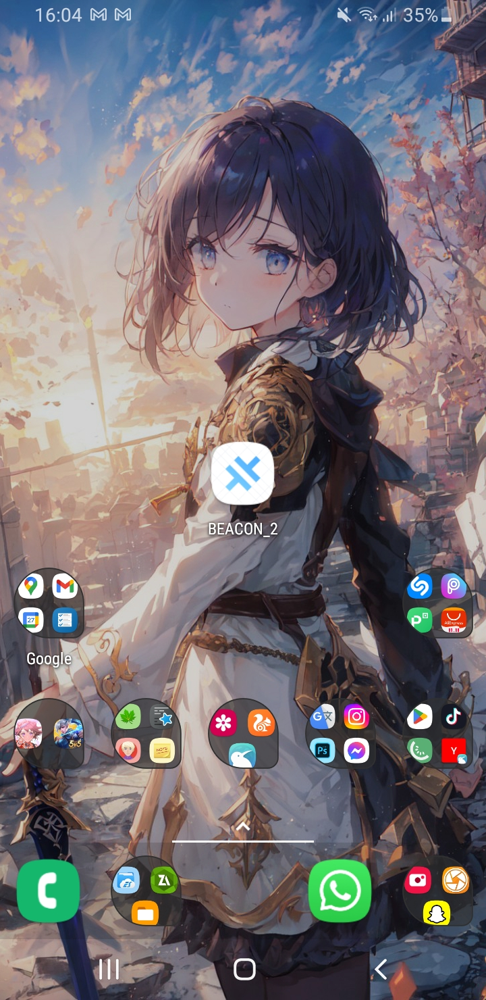
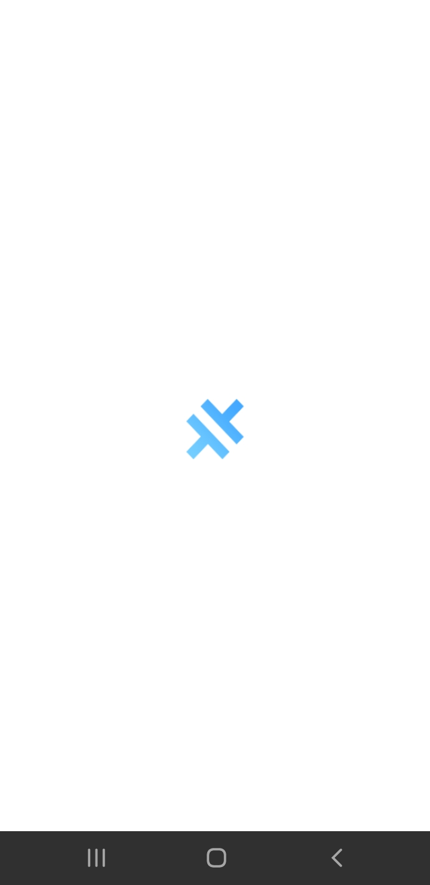
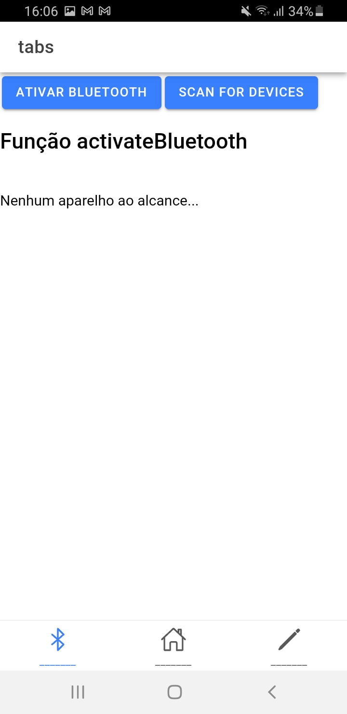
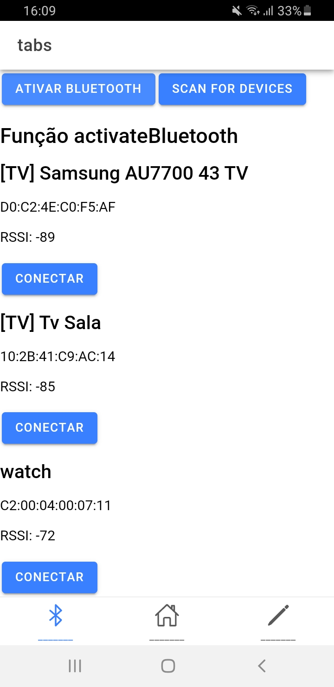
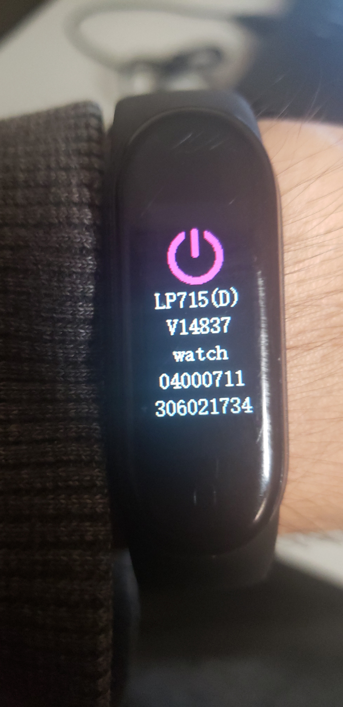
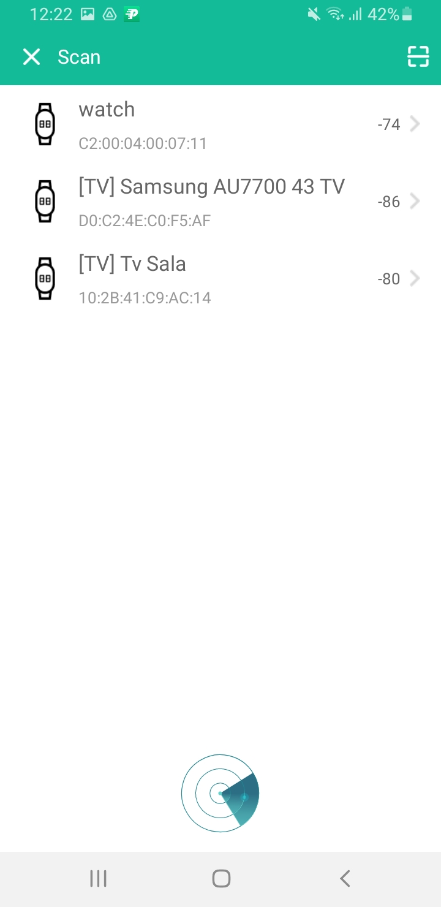

<!--
    TITLE:      README
    AUTOR:      GUSTAVO GONÇALVES DIAS NEVES
    DATA_INIT:  20.08.2023

    PROJECT:    RADAR APP - IONIC
    
    CONNECT ME:
        Linkedin: https://www.linkedin.com/in/gustavo-gon%C3%A7alves-dias-neves-3b76b3252/
        github (curr-account): https://github.com/gustavogoncalvesdiasneves/
        
 -->

<h1 align="center" alt="Aplicativo de Tarefas"><strong>BEACON APP - BLE (Bluetooth Lower Energy)</strong></h1>

 

Esse Projeto tem a finalidade de ser um Radar para Dispositivos BLE (Bluetooth Lower Energy)  
(Em desenvolvimento...)

 

 

<h2>Índice</h2>

- **[Descrição](#descrição)** 
- **[Características](#características)** 
- **[Futuras Novidades](#futuras-novidades)** 
- **[Download](#download)** 
- **[Novidades](#novidades)** 
- **[Imagens Do App](#imagens-do-app)** 

  

## **Descrição**
[BEACON APP][link-open-source] é um aplicativo de radar para dispositivos BLE (com Supporte a Android / PWA (WEB) / iOS).

  

## **Características**
A aplicação fornece os seguintes recursos:

### **Primeira tela**
- Conectar (Botão) para se conectar ao dispositivos (Futuras Funções)
- RSSI (Distancia do dispositivo - sendo a mais perta **0** , a mais longe **-100** OBS: Depende da capacidade do dispositivo)

### **Segunda tela**
- Em desenvolvimento...

### **Terceira tela**
- Radar de dispositivos pela proximidade

## **Futuras Novidades**
- Terminal BLE
- Configurações (para futuras funções, e temas)
- BEEP (Conforme a proximidade de um aparelho setado pelo usuario)
- Função Vibrar (Caso o usuario chegue na posição **0** do RSSI do Dispositivo)

  

## **Download**
Para Executar é bem simples somente baixar o [Aplicativo][download-geral] e instalar e Abrir.

 

**No Android** - [Download-Android][app-android]

 

No android é necessario ativar <strong>FONTES DESCONHECIDAS</strong> caso não tenha ativado ainda.  
<strong>(OBS: Cada Versão do Android é dieferente mas geralmente fica em 'Segurança' ou 'Aplicativos')</strong>

 

**No iOS** 

 

**EM BREVE (Link de Download)...** 

<!-- 
//**Como não tenho o sistema iOS vou deixar um** [Link][link-ios] **para ajudar vocẽs =D**
-->

 

**PWA (Em Breve...)** - [PWA-Download][pwa]

 

PWA é bem complexo pois vai ser instalado em servidores para funcionar na WEB; (Cada servidor é de um jeito) 
 

<strong>Requisitos:</strong>
 

<strong>Dominio</strong> (SSL - para funcionar perfeitamente a aplicação)

<strong>Armazenamento</strong> (para armazenar a pasta <strong>www</strong> para que funcione na WEB)

  

## **Novidades**

<h3>Previsão para versões officiais (Non-Debug) Android , iOS e PWA : 30/09/2023 </h3>

  

## **Imagens Do App**

<table border="0" cellpadding="1" cellspacing="1" style="width:500px">
	<tbody>
		<tr>
			<td></td>
			<td></td>
			<td></td>
		</tr>
		<tr>
			<td></td>
			<td></td>
			<td></td>
		</tr>
		<tr>
			<td></td>
			<td></td>
			<td></td>
		</tr>
	</tbody>
</table>

&nbsp;

<!-- 
    LOCAL VARIABLES
 -->

[link-ios-install]: https://www.apowersoft.com.br/baixar-apps-sem-app-store.html
[app-android]: https://drive.google.com/file/d/1cB9nHdU_Tz7gGsCGxyEkxNJxmJsffJy2/view?usp=sharing
[pwa]: https://github.com/gustavogoncalvesdiasneves/BEACON_SCAN_APP2/tree/master
[download-geral]: https://drive.google.com/file/d/1cB9nHdU_Tz7gGsCGxyEkxNJxmJsffJy2/view?usp=sharing
[link-open-source]: https://github.com/gustavogoncalvesdiasneves/BEACON_SCAN_APP2
